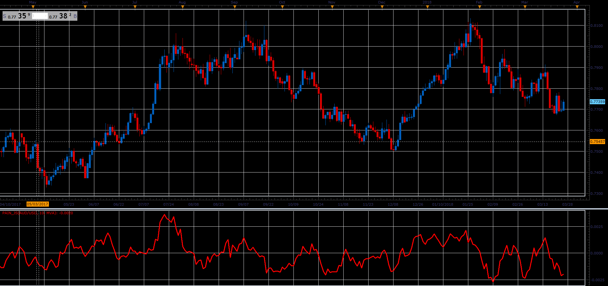

# Pain oscillator

> Source: https://fxcodebase.com/code/viewtopic.php?f=48&t=66064  
> Forum: 48 · Topic 66064 · 1 post(s)

---

## Pain oscillator

**Alexander.Gettinger** · Wed May 02, 2018 12:07 pm

Formula:
Pain = (3*MA(Close) - MA(Open) - MA(High) - MA(Low))/2, where
MA - moving average with [Length] number of periods and [Method] type.

 

Download:

 [Pain_JS.jsl](files/119016/Pain_JS.jsl)
