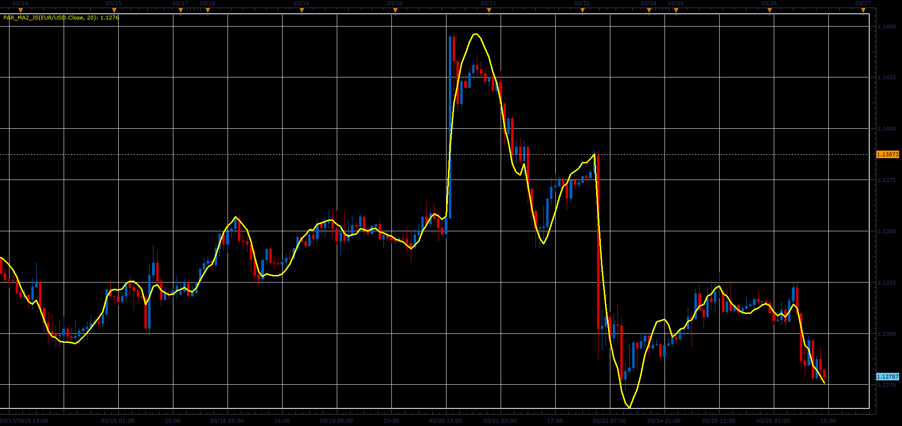
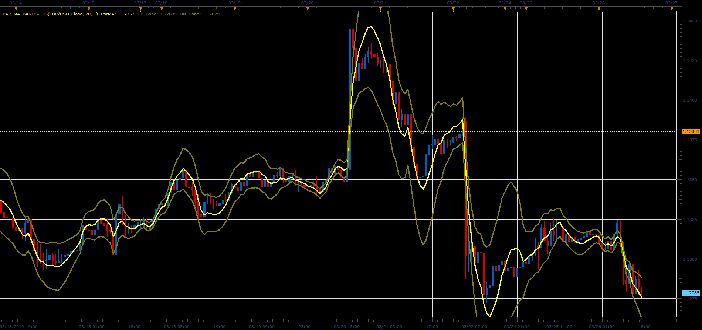

# Parabolic moving average and bands

> Source: https://fxcodebase.com/code/viewtopic.php?f=48&t=68273  
> Forum: 48 · Topic 68273 · 1 post(s)

---

## Parabolic moving average and bands

**Alexander.Gettinger** · Sat Mar 30, 2019 3:55 pm

Parabolic regression indicator.

The indicator produces the less lag than majority of other moving average indicators.

The algorithm is taken from V.P. Dyakonov. Reference book by the algorithms and programs on the Basic language for personal computers. M 1987.

 

Download:

 [Par_MA2_JS.jsl](files/125493/Par_MA2_JS.jsl)

 

Download:

 [Par_MA_Bands2_JS.jsl](files/125493/Par_MA_Bands2_JS.jsl)
