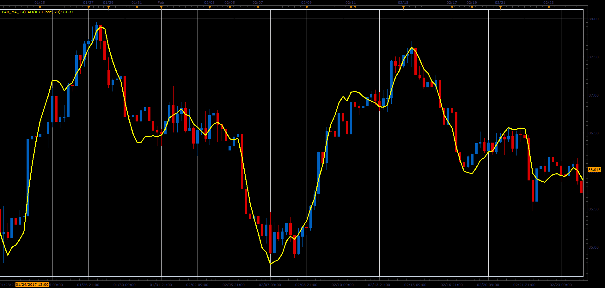
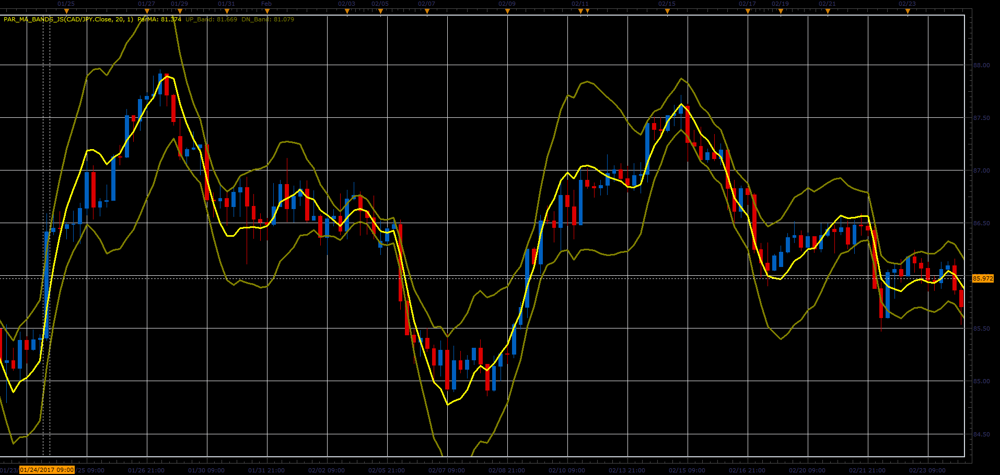

# Parabolic moving average and bands

> Source: https://fxcodebase.com/code/viewtopic.php?f=48&t=64800  
> Forum: 48 · Topic 64800 · 1 post(s)

---

## Parabolic moving average and bands

**Alexander.Gettinger** · Wed Jun 14, 2017 11:42 am

Parabolic regression indicator.

The indicator produces the less lag than majority of other moving average indicators.

The algorithm is taken from V.P. Dyakonov. Reference book by the algorithms and programs on the Basic language for personal computers. M 1987.

Parabolic MA:

 

Download:

 [Par_MA_JS.jsl](files/112894/Par_MA_JS.jsl)

Parabolic MA with bands:

 

Download:

 [Par_MA_Bands_JS.jsl](files/112894/Par_MA_Bands_JS.jsl)
