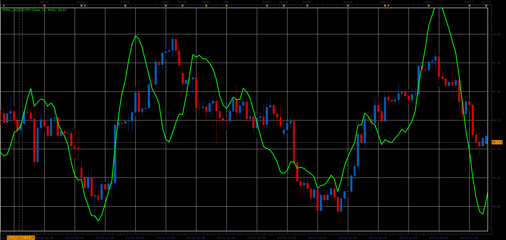

# Pentuple Exponential Moving Average

> Source: https://fxcodebase.com/code/viewtopic.php?f=48&t=64801  
> Forum: 48 · Topic 64801 · 1 post(s)

---

## Pentuple Exponential Moving Average

**Alexander.Gettinger** · Wed Jun 14, 2017 11:44 am

Formula:
PEMA=8*MA1-28*MA2+56*MA3-70*MA4+56*MA5-28*MA6+8*MA7-MA8, where
MA1=Moving Average(Price),
MA2=Moving Average(MA1),
MA3=Moving Average(MA2),
MA4=Moving Average(MA3),
MA5=Moving Average(MA4),
MA6=Moving Average(MA5),
MA7=Moving Average(MA6),
MA8=Moving Average(MA7).

 

Download:

 [PEMA_JS.jsl](files/112895/PEMA_JS.jsl)
