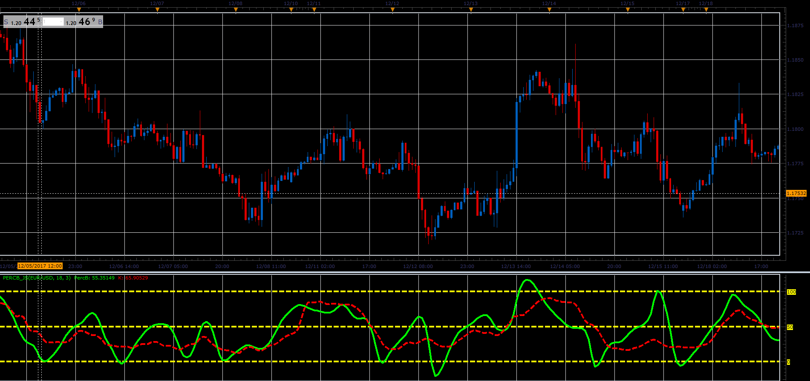

# Percent B oscillator

> Source: https://fxcodebase.com/code/viewtopic.php?f=48&t=65569  
> Forum: 48 · Topic 65569 · 1 post(s)

---

## Percent B oscillator

**Alexander.Gettinger** · Sat Jan 06, 2018 5:13 pm

Percent B oscillator is described in September 2013 issue of Stocks & Commodities (p38-43).

 

Download:

 [PercB_JS.jsl](files/116848/PercB_JS.jsl)

For this indicator must be installed TEMA1 indicator ([viewtopic.php?f=17&t=1052&p=2358](https://fxcodebase.com/code/viewtopic.php?f=17&t=1052&p=2358)).
