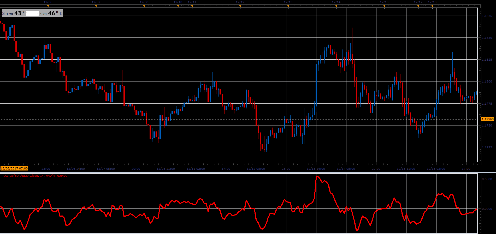

# Percent Difference Oscillator

> Source: https://fxcodebase.com/code/viewtopic.php?f=48&t=65568  
> Forum: 48 · Topic 65568 · 1 post(s)

---

## Percent Difference Oscillator

**Alexander.Gettinger** · Sat Jan 06, 2018 5:11 pm

Formula:
PDO = 100*(Price-MA)/MA, where
MA = Moving average(Price, Length, Method).

 

Download:

 [PDO_JS.jsl](files/116847/PDO_JS.jsl)
