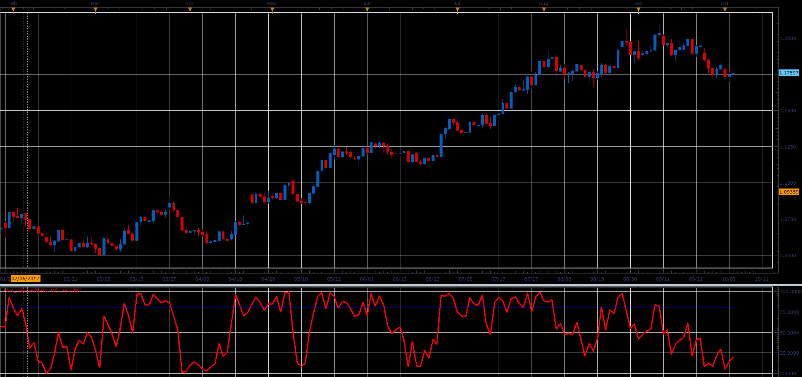

# Percent Retracement (PCR)

> Source: https://fxcodebase.com/code/viewtopic.php?f=48&t=65244  
> Forum: 48 · Topic 65244 · 1 post(s)

---

## Percent Retracement (PCR)

**Alexander.Gettinger** · Sat Oct 28, 2017 10:19 am

The Percent Retracement (PCR) measures the proximity of the current close to the maximum high over the observation period.
PCR[period] =100*(1- (max-close[period])/(max-min)).

 

Download:

 [PCR_JS.jsl](files/115668/PCR_JS.jsl)
