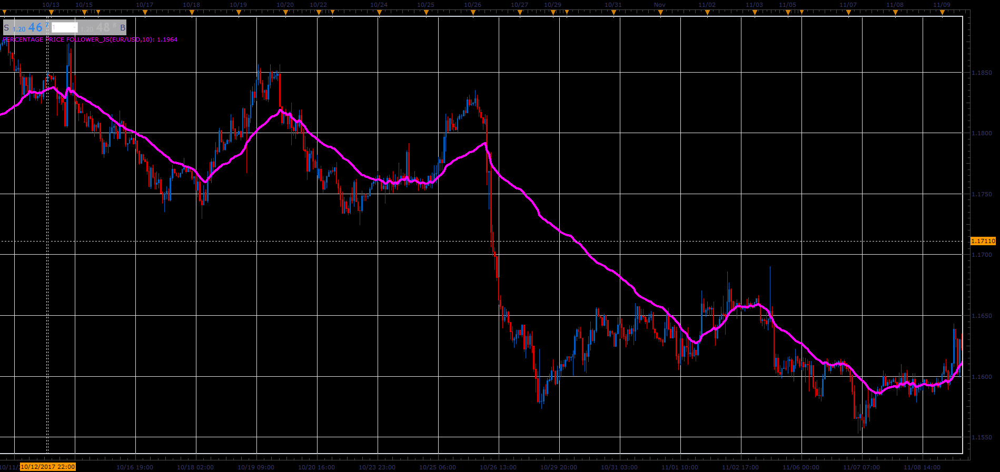

# Percentage Price Follower

> Source: https://fxcodebase.com/code/viewtopic.php?f=48&t=65570  
> Forum: 48 · Topic 65570 · 1 post(s)

---

## Percentage Price Follower

**Alexander.Gettinger** · Sat Jan 06, 2018 5:14 pm

There are two modes,
One.
The indicator follows the price, indicator is always trying to be equated with a price.
Defined percentage of the High-Low Range is the maximum shift.

Two
The indicator follows the daily changes in price, in both directions,
but only for a defined percentage of open - close Range.

 

Download:

 [Percentage Price Follower_JS.jsl](files/116849/Percentage%20Price%20Follower_JS.jsl)
