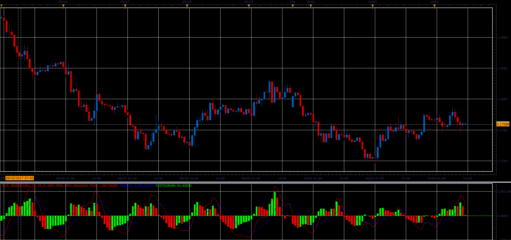

# Percentage Volume Oscillator (PVO)

> Source: https://fxcodebase.com/code/viewtopic.php?f=48&t=65254  
> Forum: 48 · Topic 65254 · 1 post(s)

---

## Percentage Volume Oscillator (PVO)

**Alexander.Gettinger** · Sat Oct 28, 2017 11:30 am

The Percentage Volume Oscillator (PVO) is a momentum oscillator for volume. PVO measures the difference between two volume-based moving averages as a percentage of the larger moving average.

Percentage Volume Oscillator (PVO):
((12-day EMA of Volume - 26-day EMA of Volume)/26-day EMA of Volume) x 100

Signal Line: 9-day EMA of PVO

PVO Histogram: PVO - Signal Line

 

Download:

 [PVO_JS.jsl](files/115678/PVO_JS.jsl)
