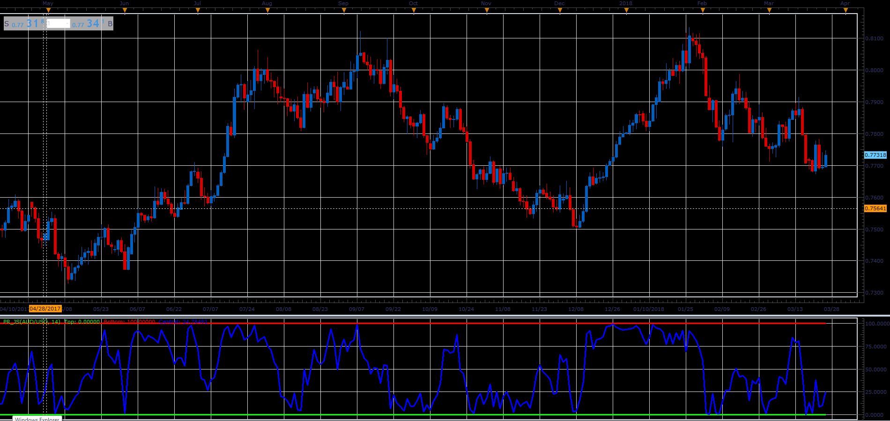

# Period Range

> Source: https://fxcodebase.com/code/viewtopic.php?f=48&t=66066  
> Forum: 48 · Topic 66066 · 1 post(s)

---

## Period Range

**Alexander.Gettinger** · Wed May 02, 2018 12:13 pm

The indicator shows percent position of the closing price within the range for last N periods,
which have preceded.

 

Download:

 [PR_JS.jsl](files/119018/PR_JS.jsl)
