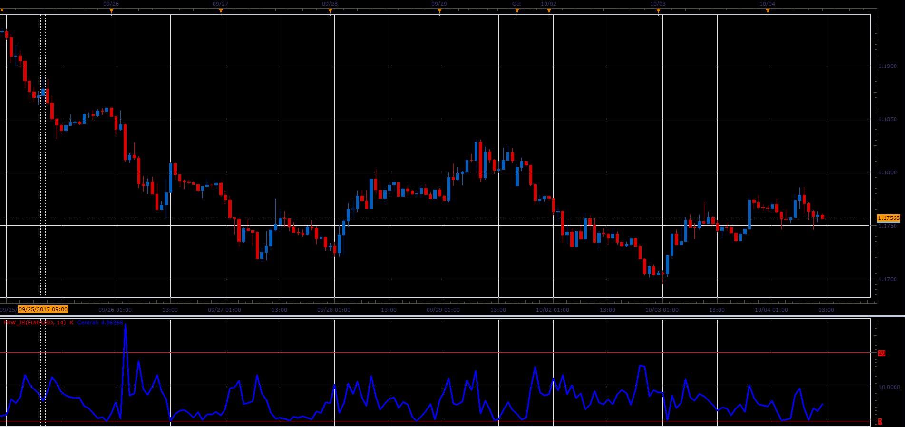

# Period Range

> Source: https://fxcodebase.com/code/viewtopic.php?f=48&t=65250  
> Forum: 48 · Topic 65250 · 1 post(s)

---

## Period Range

**Alexander.Gettinger** · Sat Oct 28, 2017 10:29 am

The indicator shows percent position of the closing price within the range for last N periods,
which have preceded.

 

Download:

 [PRW_JS.jsl](files/115674/PRW_JS.jsl)
