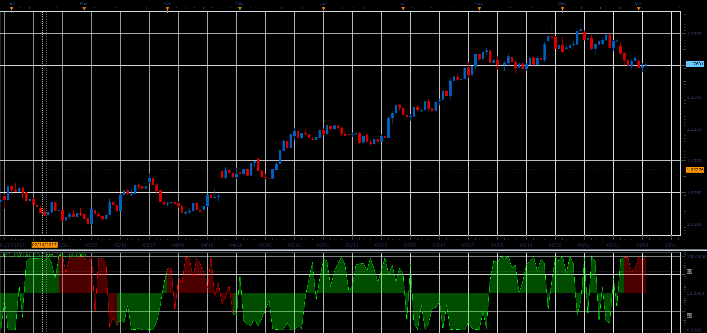

# Phase Change Index

> Source: https://fxcodebase.com/code/viewtopic.php?f=48&t=65243  
> Forum: 48 · Topic 65243 · 1 post(s)

---

## Phase Change Index

**Alexander.Gettinger** · Sat Oct 28, 2017 10:17 am

Inspired by an article Waxing And Waning : Phase Change Index by M.H. Pee
Which phase is your market going through? Find out by using this indicator.
Published in S & C magazine.

 

Download:

 [PCI_JS.jsl](files/115667/PCI_JS.jsl)
