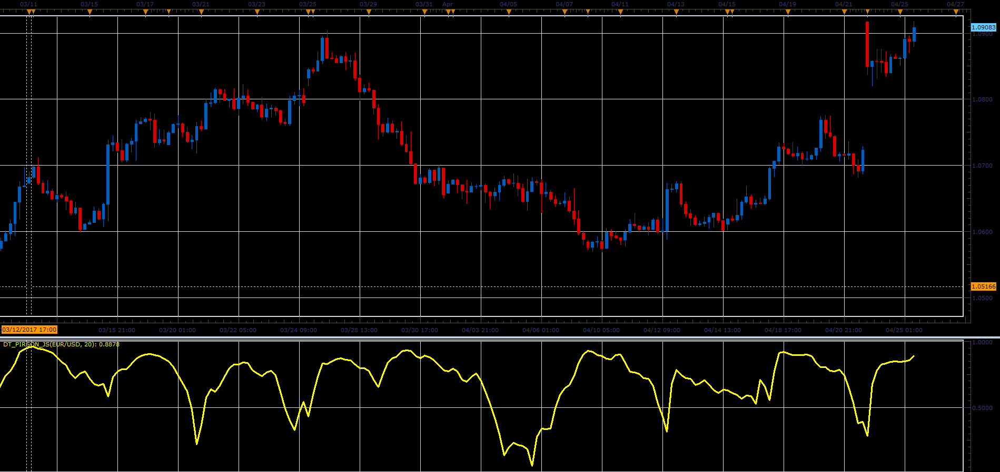

# Pirson oscillator

> Source: https://fxcodebase.com/code/viewtopic.php?f=48&t=64712  
> Forum: 48 · Topic 64712 · 1 post(s)

---

## Pirson oscillator

**Alexander.Gettinger** · Fri Jun 02, 2017 1:45 pm

The indicator shows the volatility.

Formulas:
Pirson = Sum/Res, where
Sum = sum((Close-MA)*(Close-MA)),
Res = Period*StdDev[i]*StdDev[i-1].

 

Download:

 [DT_Pirson_JS.jsl](files/112701/DT_Pirson_JS.jsl)
