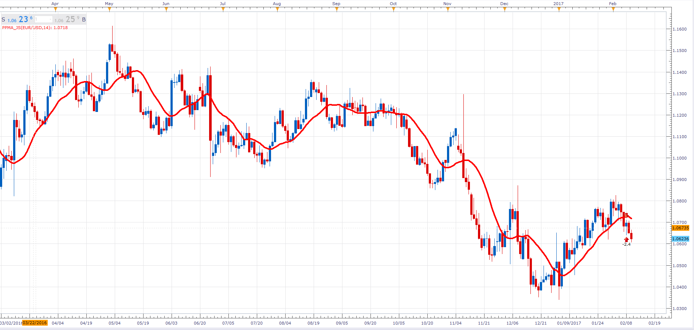

# Pivot Point Moving Average

> Source: https://fxcodebase.com/code/viewtopic.php?f=48&t=64437  
> Forum: 48 · Topic 64437 · 1 post(s)

---

## Pivot Point Moving Average

**Alexander.Gettinger** · Fri Feb 10, 2017 7:52 pm

Pivot Point Moving Average (PPMA).

 

Download:

 [PPMA_JS.jsl](files/111004/PPMA_JS.jsl)
