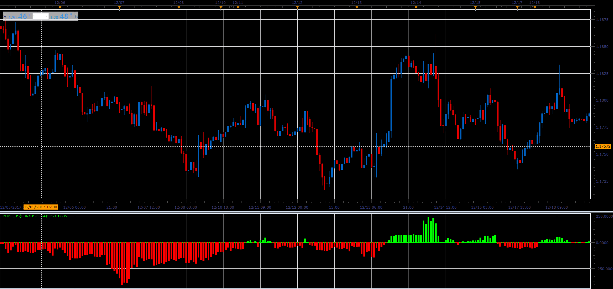

# Point of balance oscillator

> Source: https://fxcodebase.com/code/viewtopic.php?f=48&t=65573  
> Forum: 48 · Topic 65573 · 3 post(s)

---

## Point of balance oscillator

**Alexander.Gettinger** · Sat Jan 06, 2018 5:18 pm

Formula:
BLF = ((HH[n]+LH[n]) /2)
BRF = ((HL[n]+LL[n]) /2)
POB = ((BLF-BRF) /2) + BRF.

 

Download:

 [POBC_JS.jsl](files/116852/POBC_JS.jsl)

---

## Re: Point of balance oscillator

**Jeffreyvnlk** · Tue Feb 13, 2018 5:26 pm

sorry for asking the dumb question. How can I install this ?

---

## Re: Point of balance oscillator

**Apprentice** · Wed Feb 14, 2018 5:28 am

1.
[viewtopic.php?f=48&t=64425](https://fxcodebase.com/code/viewtopic.php?f=48&t=64425)
2.
[viewtopic.php?f=17&t=59681](https://fxcodebase.com/code/viewtopic.php?f=17&t=59681)
[viewtopic.php?f=17&t=17](https://fxcodebase.com/code/viewtopic.php?f=17&t=17)
