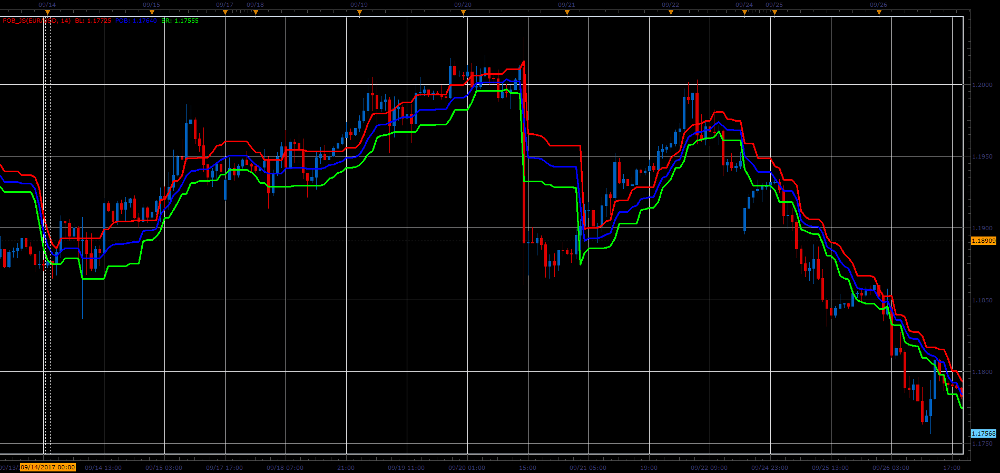

# Point of Balance

> Source: https://fxcodebase.com/code/viewtopic.php?f=48&t=65246  
> Forum: 48 · Topic 65246 · 1 post(s)

---

## Point of Balance

**Alexander.Gettinger** · Sat Oct 28, 2017 10:21 am

Formulas:
BL = (MinH+MaxH)/2,
BR = (MinL+MaxL)/2,
POB = (BL+BR)/2, where
MinH, MaxH - minimum and maximum HIGH prices at range from (i-Length) to i,
MinL, MaxL - minimum and maximum LOW prices at range from (i-Length) to i.

 

Download:

 [POB_JS.jsl](files/115670/POB_JS.jsl)
