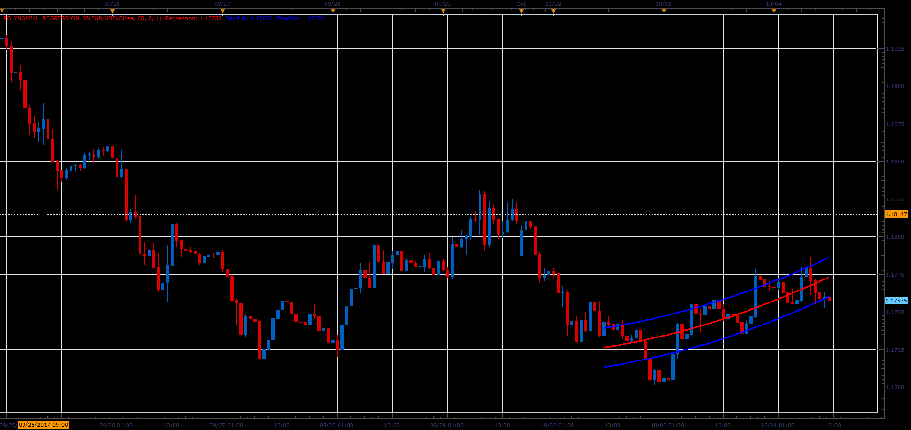

# Polynomial regression

> Source: https://fxcodebase.com/code/viewtopic.php?f=48&t=65223  
> Forum: 48 · Topic 65223 · 1 post(s)

---

## Polynomial regression

**Alexander.Gettinger** · Sat Oct 28, 2017 9:24 am

The indicator draws a regression curve that is best fits the prices between a starting price point and an ending point.

Parameter [Power] defines power of polynomial which will be used.
[Period] defines range of data on chart.
[Deviation] is used for building band.

If Power=1 we have a linear regression,
if power=2 - quadratic regression and etc.

 

Download:

 [Polynomial_Regression_JS.jsl](files/115647/Polynomial_Regression_JS.jsl)
