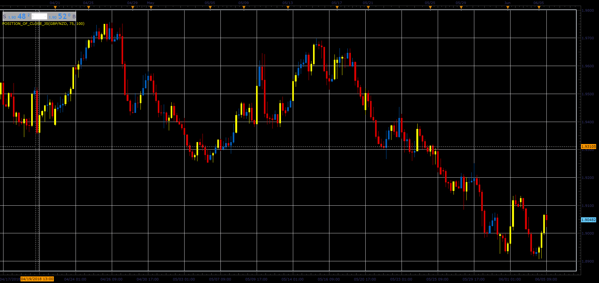

# Position of Close indicator

> Source: https://fxcodebase.com/code/viewtopic.php?f=48&t=66446  
> Forum: 48 · Topic 66446 · 1 post(s)

---

## Position of Close indicator

**Alexander.Gettinger** · Mon Aug 06, 2018 2:15 pm

The indicators highlight the bars with the specified position of Close within the bar.

 

Download:

 [Position_Of_Close_JS.jsl](files/120378/Position_Of_Close_JS.jsl)
