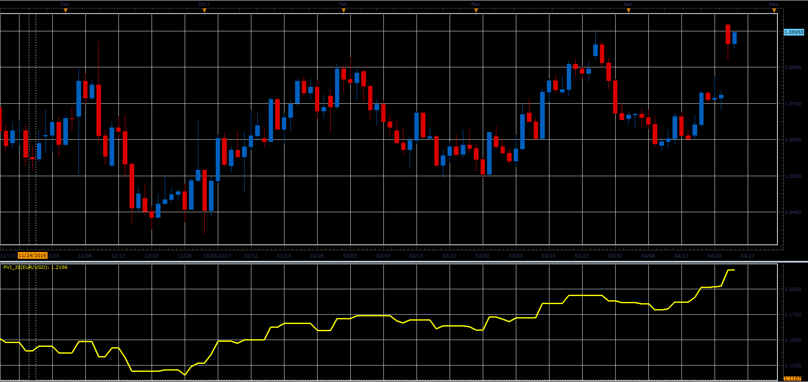

# Positive Volume Index

> Source: https://fxcodebase.com/code/viewtopic.php?f=48&t=64739  
> Forum: 48 · Topic 64739 · 1 post(s)

---

## Positive Volume Index

**Alexander.Gettinger** · Mon Jun 05, 2017 11:12 am

Formulas:
PVI[i]=PVI[i-1], if Volume[i]<=Volume[i-1] and
PVI[i]=PVI[i-1]*(1+(Close[i]-Close[i-1])/Close[i-1]), if Volume[i]>Volume[i-1].

 

Download:

 [PVI_JS.jsl](files/112750/PVI_JS.jsl)
