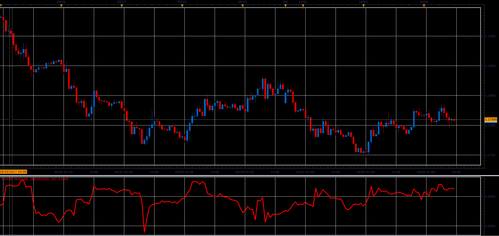

# Power Measure

> Source: https://fxcodebase.com/code/viewtopic.php?f=48&t=65248  
> Forum: 48 · Topic 65248 · 1 post(s)

---

## Power Measure

**Alexander.Gettinger** · Sat Oct 28, 2017 10:25 am

1. Stream is calculates as percentage difference between the close and previous close price.
2. Stream is calculates as percentage difference between the High and Low price.
Based on request.

Power Measure is calculates as correlation coefficient between this two streams.

 

Download:

 [Power Measure_JS.jsl](files/115672/Power%20Measure_JS.jsl)
