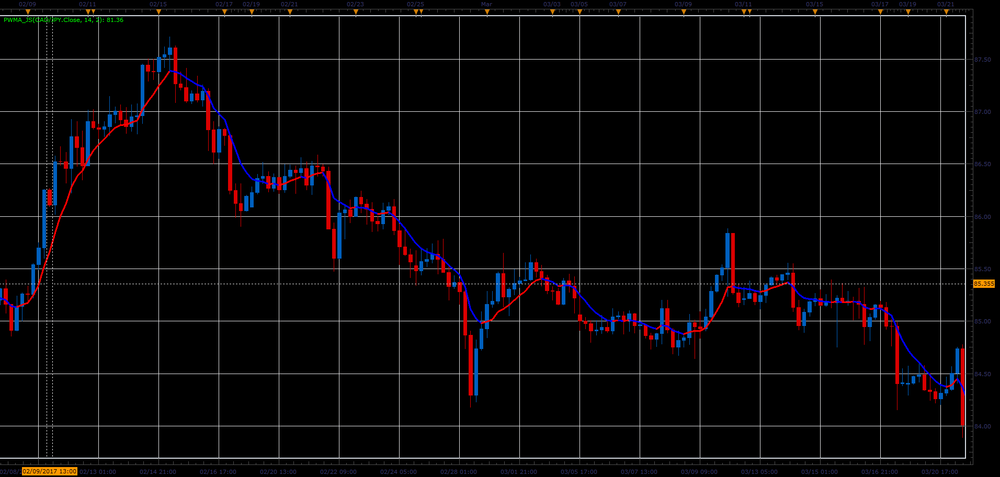

# Power weighted moving average (PWMA)

> Source: https://fxcodebase.com/code/viewtopic.php?f=48&t=64802  
> Forum: 48 · Topic 64802 · 1 post(s)

---

## Power weighted moving average (PWMA)

**Alexander.Gettinger** · Wed Jun 14, 2017 11:45 am

Formula:
PWMA = SUM(Price(i)*(i^Power), Length)/SUM(i^Power, Length).

For Power=1 PWMA is identical to Linear Weighted Moving Average (LWMA).

 

Download:

 [PWMA_JS.jsl](files/112896/PWMA_JS.jsl)
