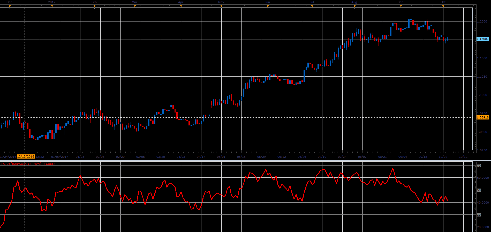

# Price Cycle

> Source: https://fxcodebase.com/code/viewtopic.php?f=48&t=65242  
> Forum: 48 · Topic 65242 · 1 post(s)

---

## Price Cycle

**Alexander.Gettinger** · Sat Oct 28, 2017 10:16 am

The indicator is defined by the formula
PC = MVA (Close-Low) /ATR(Close).

 

Download:

 [PC_JS.jsl](files/115666/PC_JS.jsl)
