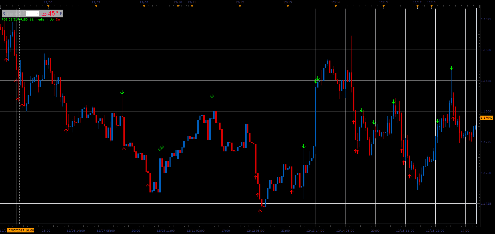

# Price Difference Indicator

> Source: https://fxcodebase.com/code/viewtopic.php?f=48&t=65567  
> Forum: 48 · Topic 65567 · 1 post(s)

---

## Price Difference Indicator

**Alexander.Gettinger** · Sat Jan 06, 2018 5:10 pm

Price Difference Indicator a.k.a HiLo Scalper Indicator will mark candles,
if difference between the current and previous candle (for selected price source)
is higher than the set value.

 

Download:

 [PDI_JS.jsl](files/116846/PDI_JS.jsl)
