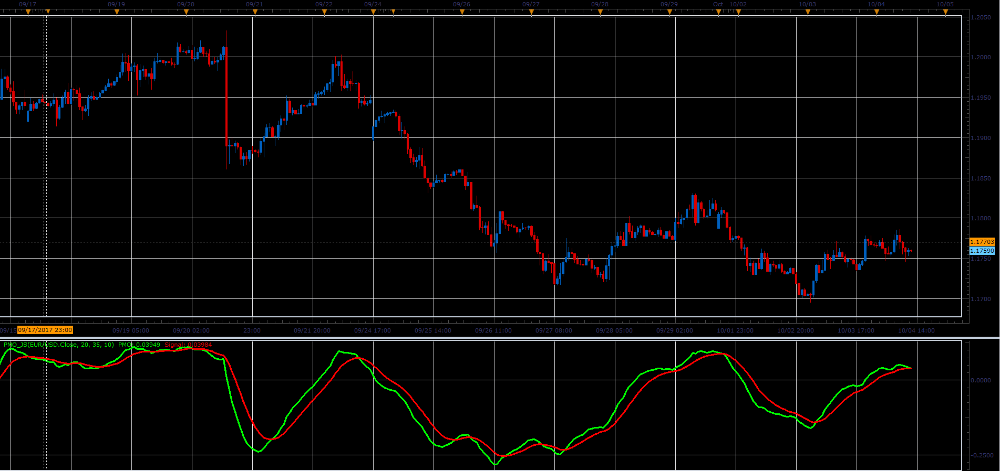

# Price Momentum Oscillator

> Source: https://fxcodebase.com/code/viewtopic.php?f=48&t=65245  
> Forum: 48 · Topic 65245 · 1 post(s)

---

## Price Momentum Oscillator

**Alexander.Gettinger** · Sat Oct 28, 2017 10:20 am

Price Momentum Oscillator (PMO) is an oscillator based on a Rate of Change (ROC) calculation that is smoothed twice with exponential moving averages that use a custom smoothing process. Because the PMO is normalized, it can also be used as a relative strength tool.

 

Download:

 [PMO_JS.jsl](files/115669/PMO_JS.jsl)
