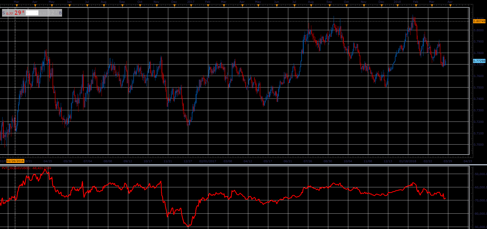

# Price Volume Trend

> Source: https://fxcodebase.com/code/viewtopic.php?f=48&t=66072  
> Forum: 48 · Topic 66072 · 1 post(s)

---

## Price Volume Trend

**Alexander.Gettinger** · Wed May 02, 2018 12:23 pm

Price and Volume Trend ("PVT") is similar to On Balance Volume ("OBV")
The amount of volume added to the PVT is determined by the amount that prices rose or fell relative to the previous day's close.

Interpretation
The interpretation of the Price and Volume Trend is similar to the interpretation of On Balance Volume and the Volume Accumulation/Distribution Line.

Calculation
PVT = ((Close-Close(-1))/Close(-1))* Volume + PVT(-1).

 

Download:

 [PVT_JS.jsl](files/119024/PVT_JS.jsl)
