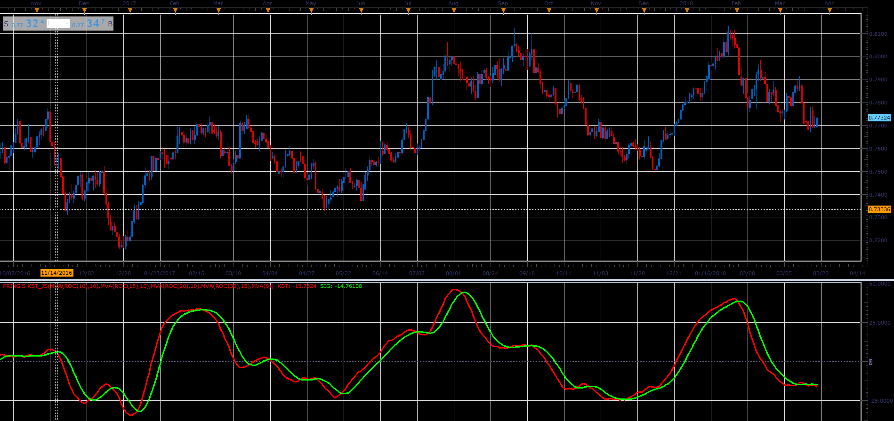

# Prings KST

> Source: https://fxcodebase.com/code/viewtopic.php?f=48&t=66067  
> Forum: 48 · Topic 66067 · 1 post(s)

---

## Prings KST

**Alexander.Gettinger** · Wed May 02, 2018 12:15 pm

KST = 1* MA(ROC(R1), M1) + 2 * MA(ROC(R2), M2) + 3 * MVA(ROC(R3), M3) + 4 * MVA(ROC(R4), M4);

 

Download:

 [Pring's KST_JS.jsl](files/119019/Prings%20KST_JS.jsl)
