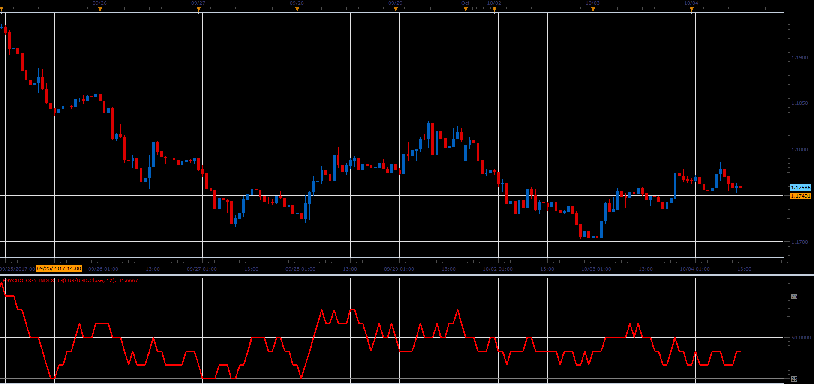

# Psychology Index

> Source: https://fxcodebase.com/code/viewtopic.php?f=48&t=65252  
> Forum: 48 · Topic 65252 · 1 post(s)

---

## Psychology Index

**Alexander.Gettinger** · Sat Oct 28, 2017 10:31 am

- Futures Magazine, Vol.29 No.6, June 2000, P.48
There was an overbought/oversold indicator described in the June
2000 Futures Magazine called the Psychological Index.

 

Download:

 [Psychology Index_JS.jsl](files/115676/Psychology%20Index_JS.jsl)
