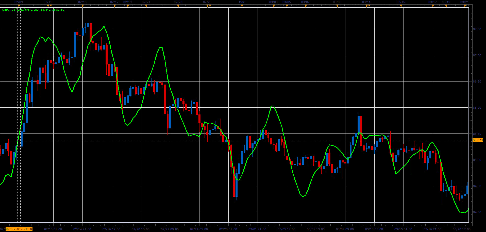

# Quadruple Exponential Moving Average

> Source: https://fxcodebase.com/code/viewtopic.php?f=48&t=64803  
> Forum: 48 · Topic 64803 · 1 post(s)

---

## Quadruple Exponential Moving Average

**Alexander.Gettinger** · Wed Jun 14, 2017 11:47 am

Formula:
QEMA=5*MA1-10*MA2+10*MA3-5*MA4+MA5, where
MA1=Moving Average(Price),
MA2=Moving Average(MA1),
MA3=Moving Average(MA2),
MA4=Moving Average(MA3),
MA5=Moving Average(MA4).

 

Download:

 [QEMA_JS.jsl](files/112897/QEMA_JS.jsl)

For this indicator must be installed Averages indicator ([viewtopic.php?f=17&t=2430](https://fxcodebase.com/code/viewtopic.php?f=17&t=2430)).
