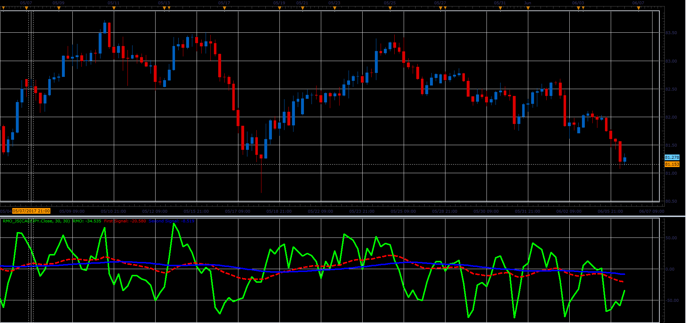

# Rahul Mohindar Oscillator

> Source: https://fxcodebase.com/code/viewtopic.php?f=48&t=64829  
> Forum: 48 · Topic 64829 · 1 post(s)

---

## Rahul Mohindar Oscillator

**Alexander.Gettinger** · Fri Jun 23, 2017 2:45 pm

Formulas:
RMO[i] = 100*x/(MaxPr-MinPr),
First signal = EMA(RMO, Length1),
Second signal = EMA(First signal, Length2), where
x[i] = Price[i]-(10*Price[i]+55*Price[i-1]+165*Price[i-2]+330*Price[i-3]+462*Price[i-4]+462*Price[i-5]+330*Price[i-6]+165*Price[i-7]+55*Price[i-8]+11*Price[i-9]+*Price[i-10])/2046,
MaxPr, MinPr - maximum and minimum prices at range from (i-10) to i.

 

Download:

 [RMO_JS.jsl](files/113086/RMO_JS.jsl)
