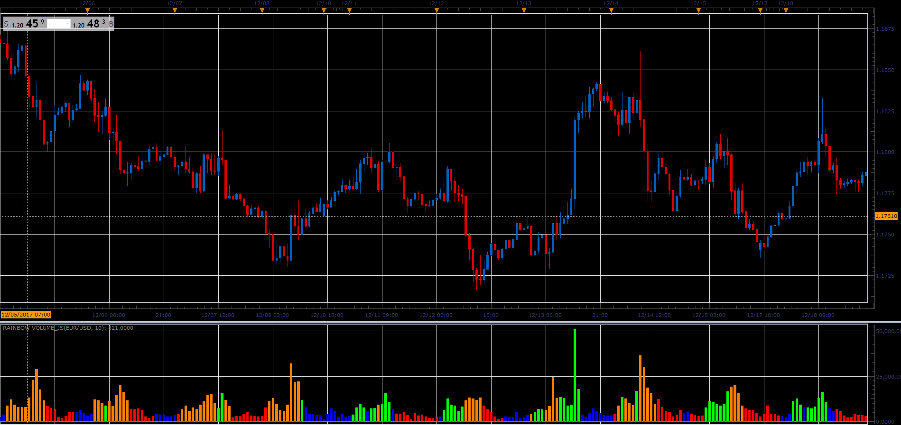

# Rainbow Volume

> Source: https://fxcodebase.com/code/viewtopic.php?f=48&t=65574  
> Forum: 48 · Topic 65574 · 1 post(s)

---

## Rainbow Volume

**Alexander.Gettinger** · Sat Jan 06, 2018 5:33 pm

As described in July 2011 issue of Stocks & Commodities magazine.

Distinguishes four situations.
Volume Up, Up Price
Volume Down, Down Price
Volume Up Price Down
Down Volume Up Price.

The indicator compares, current value and the value of N periods ago.

 

Download:

 [Rainbow Volume_JS.jsl](files/116853/Rainbow%20Volume_JS.jsl)
