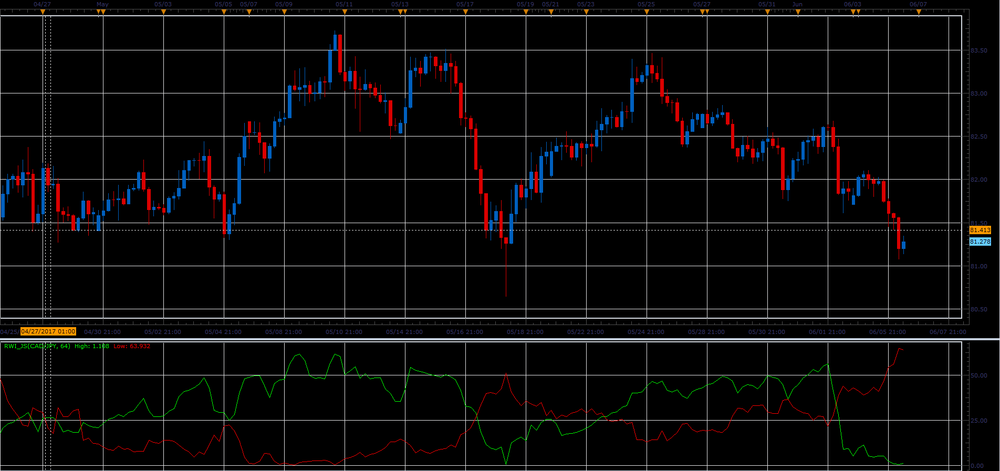

# Random Walk Index

> Source: https://fxcodebase.com/code/viewtopic.php?f=48&t=64836  
> Forum: 48 · Topic 64836 · 1 post(s)

---

## Random Walk Index

**Alexander.Gettinger** · Fri Jun 23, 2017 3:02 pm

The random walk index (RWI) is a technical indicator that attempts to determine if a stock's price movement is random or nature or a result of a statistically significant trend.

RANDOM WALK INDEX FORMULA:
High = MAX((High - Low(n)) / (ATR(n) * SQRT(n)))
Low = MAX((High(n) - Low) / (ATR(n) * SQRT(n)))

The random walk index (RWI) by E. Michael Poulos is a measure of how much price ranges over N days differ from what would be expected by a random walk (randomly going up and down).
A bigger than expected range suggests a trend.

 

Download:

 [RWI_JS.jsl](files/113093/RWI_JS.jsl)
