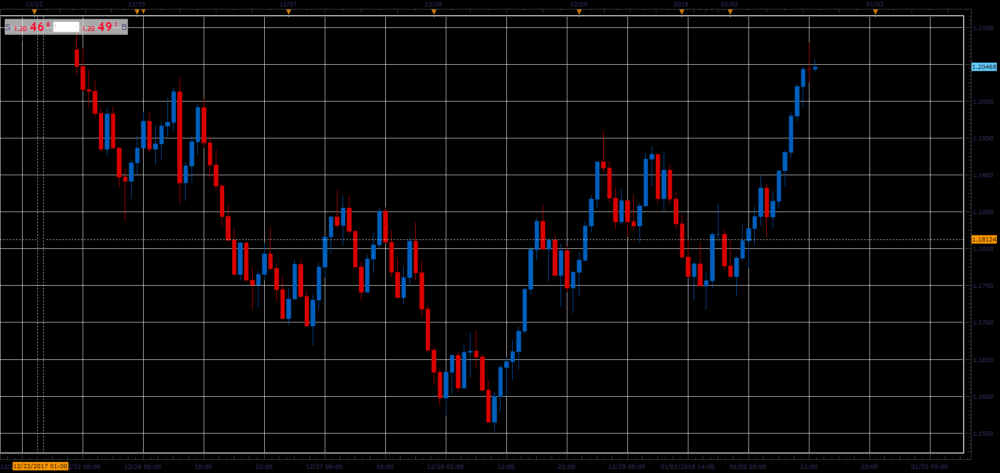

# Range bars (RB)

> Source: https://fxcodebase.com/code/viewtopic.php?f=48&t=65575  
> Forum: 48 · Topic 65575 · 1 post(s)

---

## Range bars (RB)

**Alexander.Gettinger** · Sat Jan 06, 2018 5:34 pm

The indicator draws candles each of which have a constant range from high to low. As data is used source chart. For small value of range not is always got constant range of bars.

 

Download:

 [RB_JS.jsl](files/116854/RB_JS.jsl)
