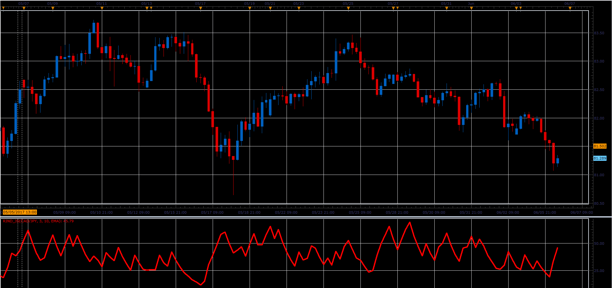

# Range Indicator

> Source: https://fxcodebase.com/code/viewtopic.php?f=48&t=64828  
> Forum: 48 · Topic 64828 · 1 post(s)

---

## Range Indicator

**Alexander.Gettinger** · Fri Jun 23, 2017 2:44 pm

Range Indicator Compares the intraday range (high - low) to the inter-day (close - previous close) range. When the intraday range is greater than the inter-day range, the Range Indicator will be a high value. This signals an end to the current trend. When the Range Indicator is at a low level, a new trend is about to start.

 

Download:

 [RIND_JS.jsl](files/113085/RIND_JS.jsl)
