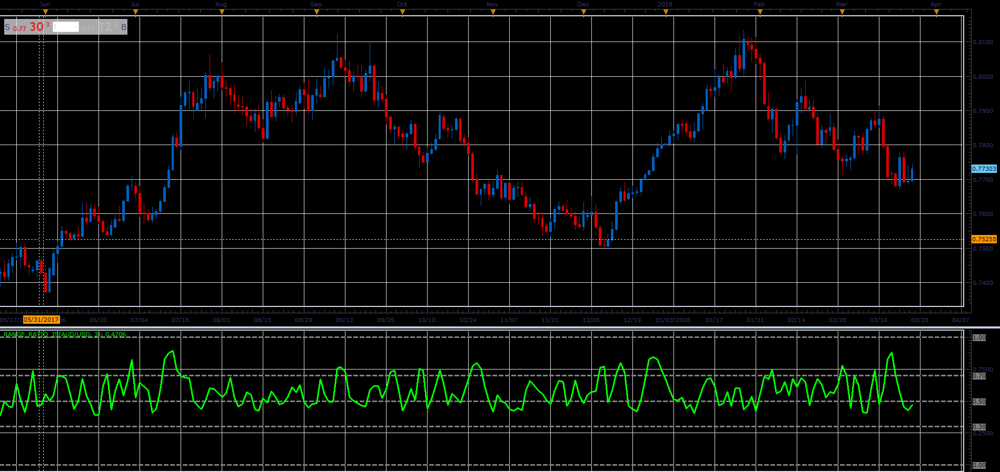

# Range ratio oscillator

> Source: https://fxcodebase.com/code/viewtopic.php?f=48&t=66073  
> Forum: 48 · Topic 66073 · 1 post(s)

---

## Range ratio oscillator

**Alexander.Gettinger** · Wed May 02, 2018 12:24 pm

Formulas:
Range ratio = (MaxP-MinP)/sum, where
MaxP[i], MinP[i] - maximum and minimum prices for range from (i-Period+1) to i,
sum = sum of (High-Low) for range from (i-Period+1) to i.

 

Download:

 [Range_Ratio_JS.jsl](files/119025/Range_Ratio_JS.jsl)
