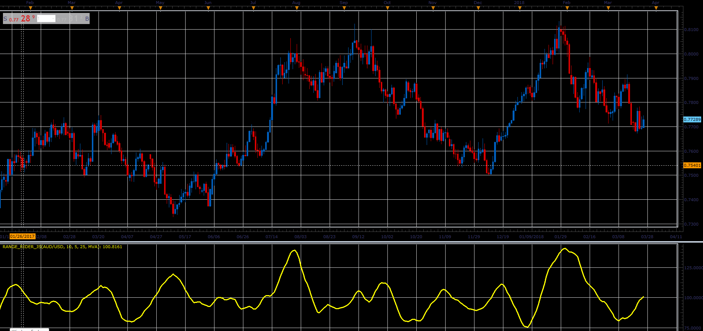

# Range Rider oscillator

> Source: https://fxcodebase.com/code/viewtopic.php?f=48&t=66074  
> Forum: 48 · Topic 66074 · 1 post(s)

---

## Range Rider oscillator

**Alexander.Gettinger** · Wed May 02, 2018 12:26 pm

Formula:
RR=100*MA1/MA2, where
MA1=MA(ATR) with [Period1] number of periods,
MA2=MA(ATR) with [Period2] number of periods.

 

Download:

 [Range_Rider_JS.jsl](files/119026/Range_Rider_JS.jsl)

For this oscillator must be installed Averages indicator ([viewtopic.php?f=17&t=2430](https://fxcodebase.com/code/viewtopic.php?f=17&t=2430)).
