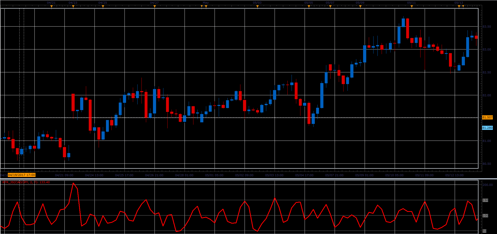

# Range To Range oscillator

> Source: https://fxcodebase.com/code/viewtopic.php?f=48&t=64835  
> Forum: 48 · Topic 64835 · 1 post(s)

---

## Range To Range oscillator

**Alexander.Gettinger** · Fri Jun 23, 2017 3:00 pm

Range To Range can be defined as ATR Ratio.
RTR = (ATR(Fast)/ATR(Slow))*100.

 

Download:

 [RTR_JS.jsl](files/113092/RTR_JS.jsl)
