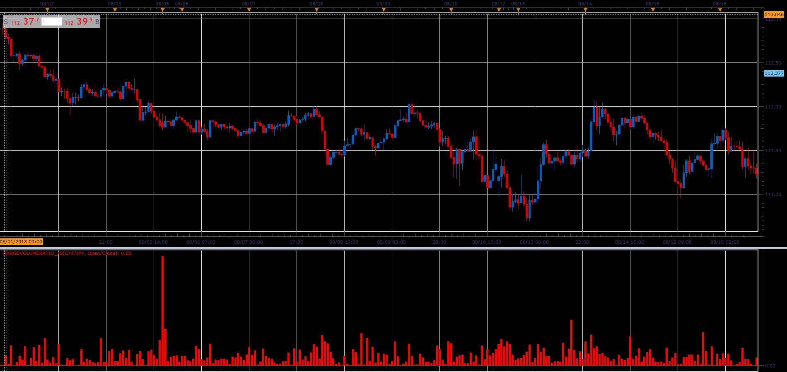

# Range Volume Ratio

> Source: https://fxcodebase.com/code/viewtopic.php?f=48&t=66985  
> Forum: 48 · Topic 66985 · 1 post(s)

---

## Range Volume Ratio

**Alexander.Gettinger** · Sat Nov 24, 2018 3:16 pm

Formula:
RVR[i] = Abs(Open[i]-Close[i])/Volume[i], if Method="Open/Close",
RVR[i] = (High[i]-Low[i])/Volume[i], if Method="High/Low".

 

Download:

 [RangeVolumeRatio_JS.jsl](files/122314/RangeVolumeRatio_JS.jsl)
