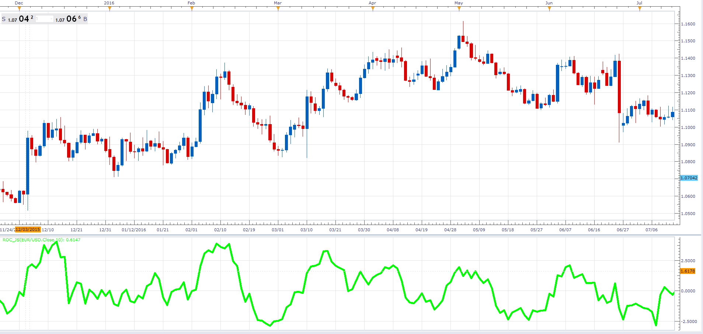

# Rate of change

> Source: https://fxcodebase.com/code/viewtopic.php?f=48&t=64358  
> Forum: 48 · Topic 64358 · 1 post(s)

---

## Rate of change

**Alexander.Gettinger** · Fri Jan 27, 2017 11:56 am

Rate of change (ROC) is a technical indicator showing the difference between today's price and the price N days ago.

 

Download:

 [ROC_JS.jsl](files/110750/ROC_JS.jsl)
