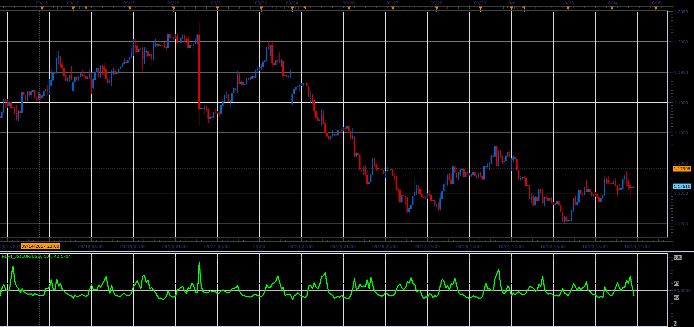

# RBVI oscillator

> Source: https://fxcodebase.com/code/viewtopic.php?f=48&t=65256  
> Forum: 48 · Topic 65256 · 1 post(s)

---

## RBVI oscillator

**Alexander.Gettinger** · Sat Oct 28, 2017 11:32 am

Formulas:
RBVI[i]=100*Positive[i]/(Positive[i]+Negative[i]), where
Positive - average of sump, Negative - average of sumn,
if rel>0 sump=rel and sumn=0,
if rel<0 sumn=-rel, sump=0,
rel=ATR[i]*Volume[i]-ATR[i-1]*Volume[i-1].

 

Download:

 [RBVI_JS.jsl](files/115680/RBVI_JS.jsl)
