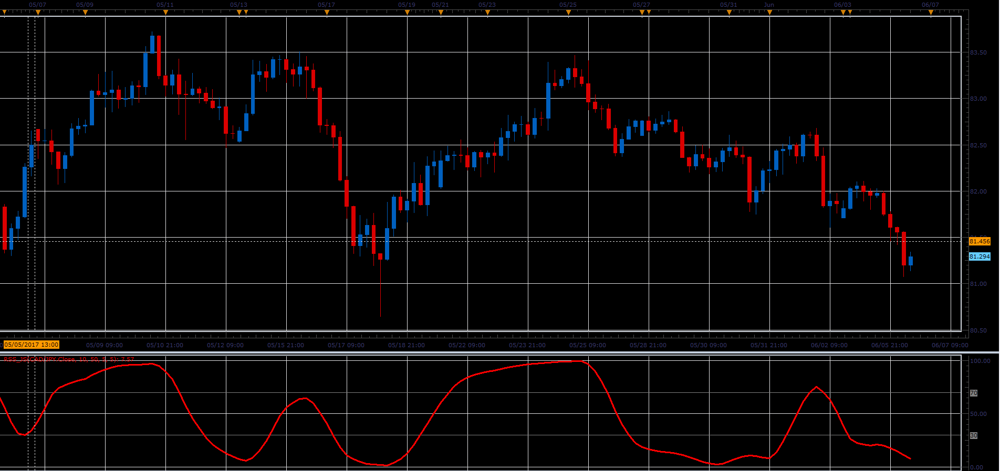

# Relative Spread Strength

> Source: https://fxcodebase.com/code/viewtopic.php?f=48&t=64832  
> Forum: 48 · Topic 64832 · 1 post(s)

---

## Relative Spread Strength

**Alexander.Gettinger** · Fri Jun 23, 2017 2:50 pm

Formula:
RSS = MVA(RSI, Smoothing_Length), where
RSI = RSI(Short_EMA(Price)-Long_EMA(Price)).

 

Download:

 [RSS_JS.jsl](files/113089/RSS_JS.jsl)
