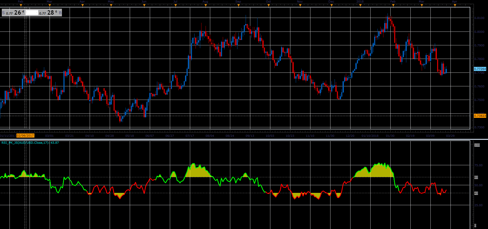

# Relative Stength Index with zone and trend highlighting

> Source: https://fxcodebase.com/code/viewtopic.php?f=48&t=66018  
> Forum: 48 · Topic 66018 · 1 post(s)

---

## Relative Stength Index with zone and trend highlighting

**Alexander.Gettinger** · Tue May 01, 2018 1:41 pm

This indicator is just a regular RSI calculated using this formula:

RSI(n) is
pos := if close >= close[-1] then close - close[-1] else 0
neg := if close < close[-1] then close[-1] - close else 0
rs := WMA(pos, n) / WMA(neg, n)
rsi := 100 - (100 / (1 + rs))

View of this indicator is optimized for working and displaying the results of the "Combining RSI with RSI" strategy described in the Peter Konner's article in January 2011 issues of "Stock & Commodities"

The indicator additionally:
a) Changes the line color depending on the trend direction shown by RSI indicator.
b) Highlight areas above and below the levels chosen

 

Download:

 [RSI_PK_JS.jsl](files/118944/RSI_PK_JS.jsl)
