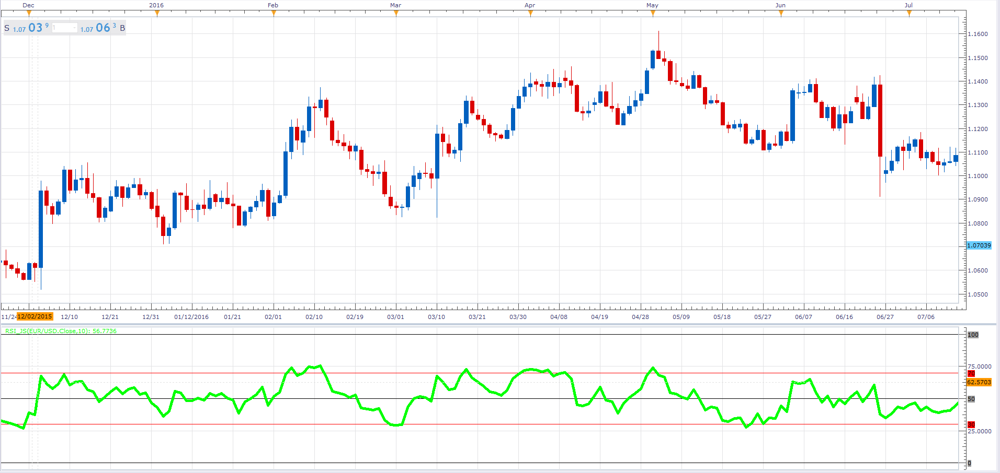

# Relative Strength Index

> Source: https://fxcodebase.com/code/viewtopic.php?f=48&t=64357  
> Forum: 48 · Topic 64357 · 1 post(s)

---

## Relative Strength Index

**Alexander.Gettinger** · Fri Jan 27, 2017 11:52 am

Relative Strength Index (RSI) is a price-following oscillator that ranges between 0 and 100.

 

Download:

 [RSI_JS.jsl](files/110749/RSI_JS.jsl)
