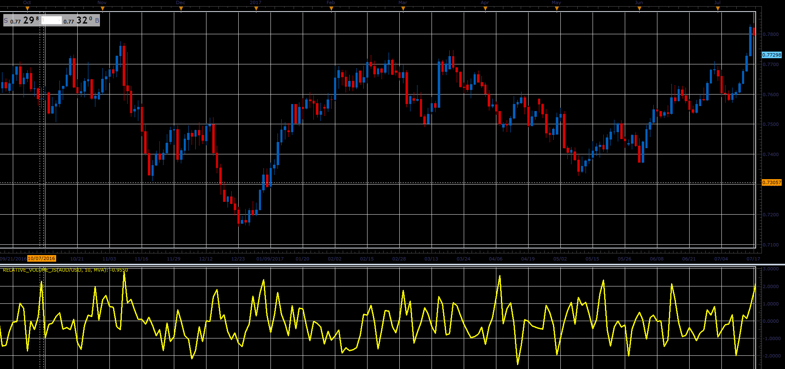

# Relative volume oscillator

> Source: https://fxcodebase.com/code/viewtopic.php?f=48&t=66076  
> Forum: 48 · Topic 66076 · 1 post(s)

---

## Relative volume oscillator

**Alexander.Gettinger** · Wed May 02, 2018 12:31 pm

Download:

 [Relative_Volume_JS.jsl](files/119028/Relative_Volume_JS.jsl)

For this oscillator must be installed Averages indicator ([viewtopic.php?f=17&t=2430](https://fxcodebase.com/code/viewtopic.php?f=17&t=2430)).
