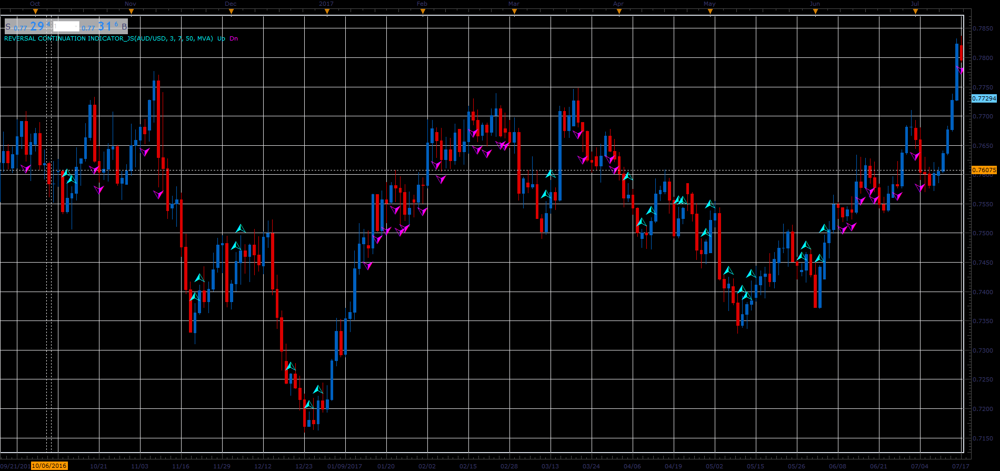

# Reversal Continuation Indicator

> Source: https://fxcodebase.com/code/viewtopic.php?f=48&t=66077  
> Forum: 48 · Topic 66077 · 1 post(s)

---

## Reversal Continuation Indicator

**Alexander.Gettinger** · Wed May 02, 2018 12:33 pm

The indicator shows Reversal / Continuation of the trend.
The trend is defined by at positions of moving averages.

 

Download:

 [Reversal Continuation Indicator_JS.jsl](files/119029/Reversal%20Continuation%20Indicator_JS.jsl)
