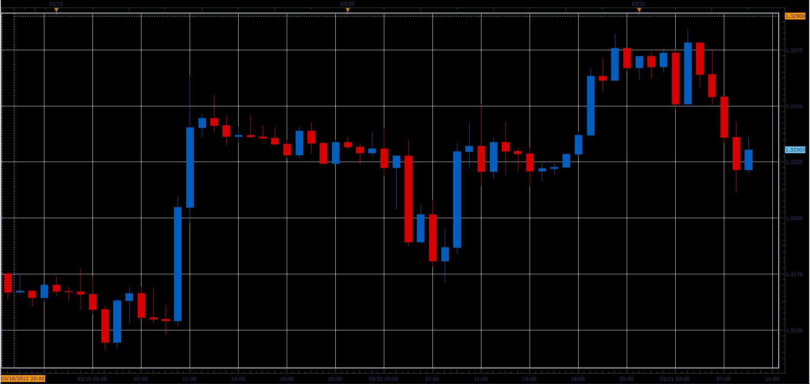

# Reverse candles indicator

> Source: https://fxcodebase.com/code/viewtopic.php?f=48&t=64741  
> Forum: 48 · Topic 64741 · 1 post(s)

---

## Reverse candles indicator

**Alexander.Gettinger** · Mon Jun 05, 2017 11:19 am

Indicator inverts the symbol.
Instead, EUR/USD will be USD/EUR.

Before:

 

After:

 [18329](files/112752/ReverseChart2.PNG)

Download:

 [Reversel_Candles_JS.jsl](files/112752/Reversel_Candles_JS.jsl)
