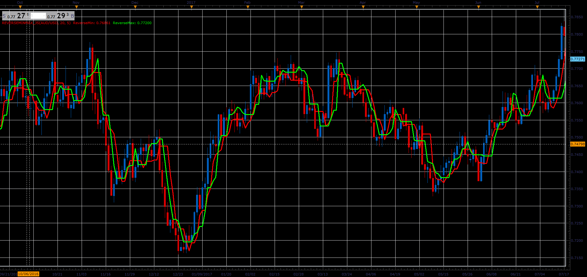

# ReverseMinMax indicator

> Source: https://fxcodebase.com/code/viewtopic.php?f=48&t=66079  
> Forum: 48 · Topic 66079 · 1 post(s)

---

## ReverseMinMax indicator

**Alexander.Gettinger** · Wed May 02, 2018 12:35 pm

Formulas:
ReverseMin[i] = Low[HL],
ReverseMax[i] = High[LH],
Min[i] = Low[LL],
Max[i] = High[HH], where
HL - index of highest Low price at range from (i-Reverse_Length+1) to (i-1),
LH - index of lowest High price at range from (i-Reverse_Length+1) to (i-1),
HH - index of highest High price at range from (i-Length+1) to (i-1),
LL - index of lowest Low price at range from (i-Length+1) to (i-1).

 

Download:

 [ReverseMinMax_JS.jsl](files/119031/ReverseMinMax_JS.jsl)
