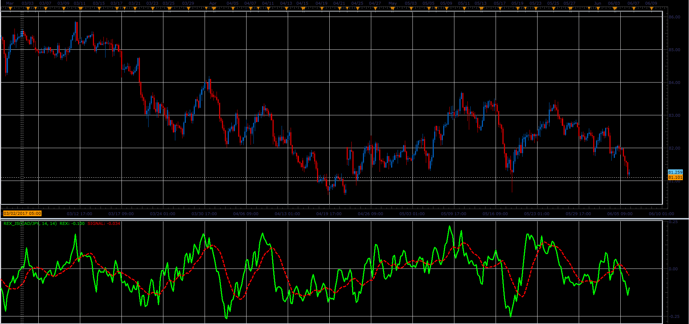

# REX Indicator

> Source: https://fxcodebase.com/code/viewtopic.php?f=48&t=64826  
> Forum: 48 · Topic 64826 · 3 post(s)

---

## REX Indicator

**Alexander.Gettinger** · Fri Jun 23, 2017 2:39 pm

True Value of a Bar (TVB) gives us an indication of how healthy the market is.

TVB = 3 * Close – (Low + Open + High)

Rex Oscillator is a moving average of the TVB, indicating the inertia of the market. When the Rex Oscillator turns positive in a bearish trend, a reversal is indicated.
Likewise, Rex turning negative in a bull market indicates a reversal to the downside.

 

Download:

 [REX_JS.jsl](files/113083/REX_JS.jsl)

---

## Re: REX Indicator

**durlovjagiroad** · Mon Oct 28, 2019 9:34 am

mt4 version with custom currencypair option.

---

## Re: REX Indicator

**Apprentice** · Thu Nov 07, 2019 8:45 am

MT4/MQ4 version.
[viewtopic.php?f=38&t=61373](https://fxcodebase.com/code/viewtopic.php?f=38&t=61373)
