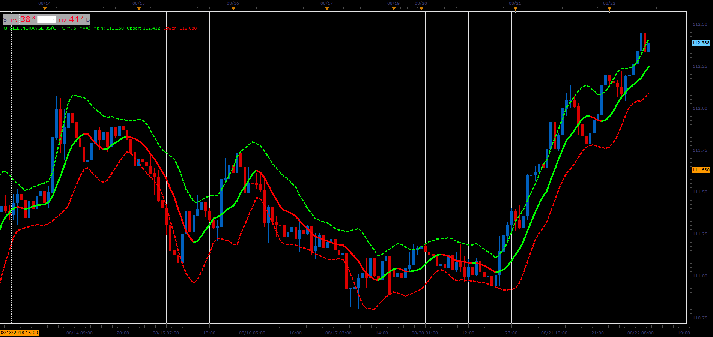

# Rj_SlidingRange indicator

> Source: https://fxcodebase.com/code/viewtopic.php?f=48&t=66987  
> Forum: 48 · Topic 66987 · 1 post(s)

---

## Rj_SlidingRange indicator

**Alexander.Gettinger** · Sat Nov 24, 2018 3:20 pm

Upper line is a moving average of high prices, Lower line is a MA of low prices.
Main=(Upper+Lower)/2.

 

Download:

 [Rj_SlidingRange_JS.jsl](files/122316/Rj_SlidingRange_JS.jsl)

For this indicator must be installed AVERAGES indicator ([viewtopic.php?f=17&t=2430](https://fxcodebase.com/code/viewtopic.php?f=17&t=2430)).
