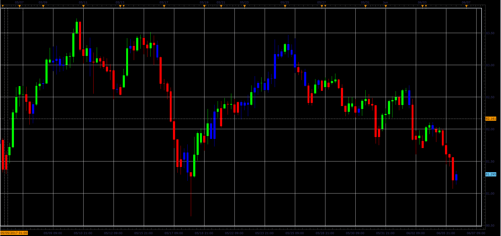

# Rotation Factor indicator

> Source: https://fxcodebase.com/code/viewtopic.php?f=48&t=64827  
> Forum: 48 · Topic 64827 · 1 post(s)

---

## Rotation Factor indicator

**Alexander.Gettinger** · Fri Jun 23, 2017 2:42 pm

The indicator shows the current state of Rotation Factor.

 

Download:

 [RF_JS.jsl](files/113084/RF_JS.jsl)
