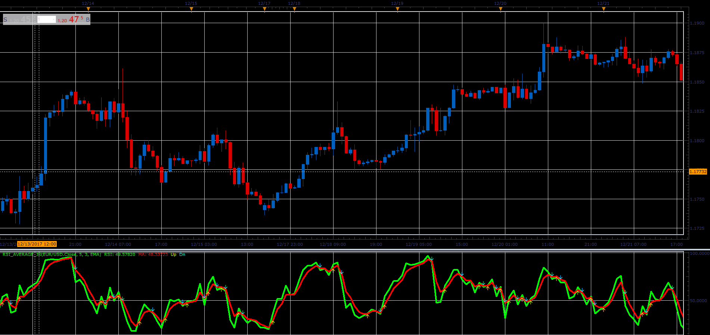

# RSI average indicator

> Source: https://fxcodebase.com/code/viewtopic.php?f=48&t=65579  
> Forum: 48 · Topic 65579 · 1 post(s)

---

## RSI average indicator

**Alexander.Gettinger** · Sat Jan 06, 2018 5:40 pm

Formulas:
RSI - Relative Strength Index,
MA - Moving average(RSI).

 

Download:

 [RSI_Average_JS.jsl](files/116858/RSI_Average_JS.jsl)

For this indicator must be installed Averages indicator ([viewtopic.php?f=17&t=2430](https://fxcodebase.com/code/viewtopic.php?f=17&t=2430)).
